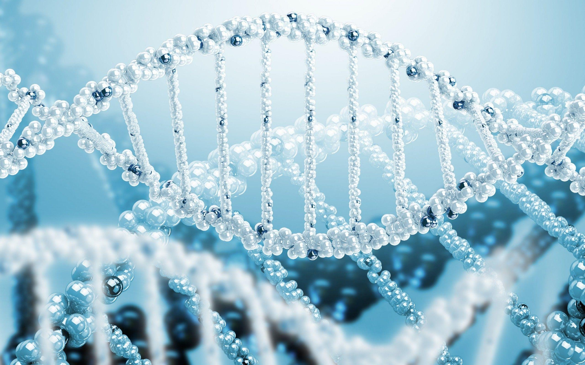

    

  

The **[CRI Bioinformatics Unit (CBU)](https://bi-ctsicn.github.io/CBU/)** provides bioinformatics consultation and analytical services in an initiative sponsored by the _[Center for Genetic Medicine Research](https://childrensnational.org/research-and-education/center-for-genetic-medicine-research)_, the _[Center for Translational Science](https://childrensnational.org/research-and-education/center-for-translational-science)_, the _[Clinical and Translational Institute at Children’s National (CTSI-CN)](https://www.ctsicn.org/)_, the _[District of Columbia Intellectual and Developmental Disabilities Research Center (DC-IDDRC)](http://www.dciddrc.org/)_ and the _[Chief Research Officer’s office](https://childrensnational.org/research-and-education/about-cri/faculty-and-leadership-directory/vittorio-gallo)_ at _**[Children's National Medical Center](https://childrensnational.org/)**_.

# We assist in the following:

## **1. Experimental Design Consultation**

## **2. Grant Technical Writing Support**

## **3. Data Analysis**
 
* **RNA sequencing**
    * Differential Gene Expression  
    * Single Nucleotide Variation Detection 
    * Fusion Analysis
* **Whole Genome sequencing**
    * De Novo Assembly 
    * Single Nucleotide Variation Detection 
    * Copy Number Variation 
    * Structural Variant Detection
* **Exome sequencing**
    * Single Nucleotide Variation Detection 
    * Copy Number Variation 
    * Structural Variant Detection
* **Microbiome Analysis (16s and metagenomics)**
* **Single Cell Sequencing**
* **T-cell receptor Sequencing** 
* **Methylation Sequencing (Bisulphite Sequencing)**
* **Chip Sequencing**
* **Microarray**
* **Other/Custom Analysis**

CBU also actively participates in training the next generation of biomedical researchers with the goal of enabling quality research and education.

### **We generally recommend people either to share their data for analysis via Hard Drive (Mac compatible) or via Dropbox**

_Along with Data submission we request people to fill out the following a submission form -_

  

     

> Preliminary data procesiing and analysis turnaround time is generally  2-3 weeks depending upon experiment and number of samples. Further downstream data analysis, may take more time. Timeline may be assessed upon consultation.

### **Contact Us**
`bioinformatics@childrensnational.org`

